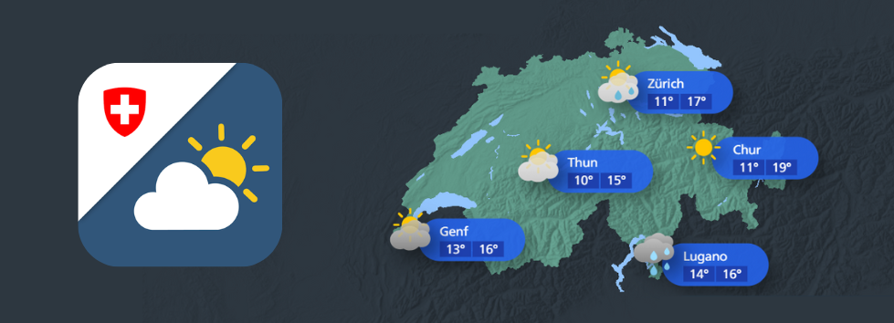

## Welcome to MeteoSwiss on GitHub!

MeteoSwiss is the Swiss Federal Office for Meteorology and Climatology.
On behalf of the Federal Government, MeteoSwiss performs the activities set out in the Federal Act on Meteorology and Climatology.
We operate the national surface and radar measurement network, and we collect, manage and analyse weather and climate data.
We produce forecasts, and issue information, warnings and advice. We are also engaged in researching and developing tailor-made products and services.

Check out our webpage for more details about MeteoSwiss and our services, or simply to get your local Swiss weather forecast and climate information.

[https://www.meteoswiss.ch/](https://www.meteoswiss.ch/)

We also provide a [Mobile App](https://www.meteoschweiz.admin.ch/service-und-publikationen/service/wetter-und-klimaprodukte/meteoswiss-app.html) for both iOS and Android.
